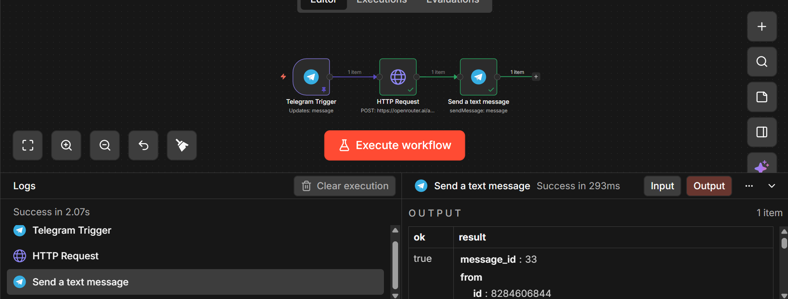

# AI Telegram Chatbot using n8n
 
This project demonstrates a Telegram chatbot built using n8n workflow automation and API integrations. The bot receives user messages through Telegram, processes them using workflow logic, and sends automated responses.
 
## Features
- Telegram Bot integration
- Real-time message processing
- Workflow automation using n8n
- API-based response handling
- Webhook-triggered workflow execution
 
## Tech Stack
- n8n (Workflow Automation)
- Telegram Bot API
- REST APIs
- JSON workflows
 
## Architecture
User → Telegram → Telegram Bot API → HTTP → n8n Workflow → Response → Telegram
 
## Workflow Screenshot
 

 
## How It Works
1. User sends a message to the Telegram bot
2. Telegram triggers a webhook
3. The HTTP starts the n8n workflow
4. The workflow processes the message
5. A response is sent back to the user through the Telegram Bot API
 
## Setup Instructions
1. Create a Telegram bot using BotFather
2. Import the workflow JSON file into n8n
3. Configure Telegram API credentials
4. Activate the workflow
5. Start chatting with the bot

